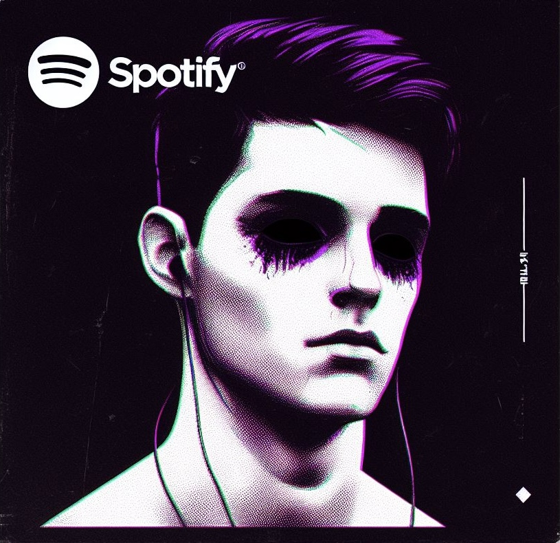

<!-- https://shields.io/ -->

  
  

	
	

## My Music ↙️ 

  

	

---

## About Me :

I am a web3/blockchain enthusiast acting as an investor and developer in this huge blockchain ecosystem.

- 🔭 I’m currently working on geting my personal brand as a digital strategic consultant to the next level
- 🌱 I’m currently learning C, Python and Rust
- 🤔 I’m looking for some peers to build some big stuff
- 📫 How to reach me: diegorubiomorato@gmail.com
